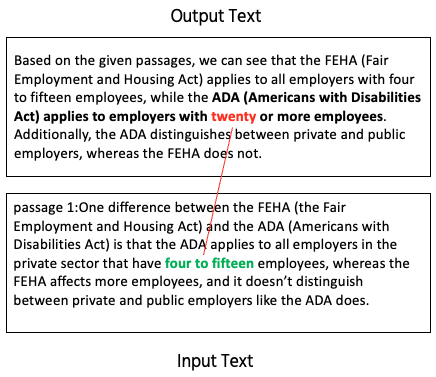
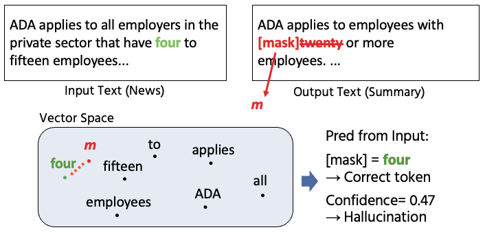

# HalluSpan_EviAlign

Implementation of [Hallucination Span Detection with Input-Side Evidence Alignment](https://arxiv.org/abs/2608.15804). Given a source document (Document) and generated text (Response), the method detects hallucinated output tokens and returns input-side evidence for each token.



The method assumes that faithful output tokens can be predicted from the input with high confidence, whereas hallucinated tokens cannot. During training, SRL-based spans are replaced with two `<mask>` tokens. At inference time, each output subword token is replaced with one `<mask>` token. The maximum cosine similarity between the masked-position representation and Document-token representations is used as the confidence score; the Document token attaining that maximum is returned as evidence alignment.



## Environments

SRL preprocessing and ModernBERT training/inference require incompatible PyTorch and Transformers versions. Use **separate virtual environments**; do not install both requirements files into one environment.

| Purpose | Requirements | Python | Main libraries |
| --- | --- | --- | --- |
| ModernBERT training, inference, and viewer | [`requirements_modernbert.txt`](requirements_modernbert.txt) | 3.11.8 tested | PyTorch 2.9.1, Transformers 4.57.3 |
| SRL span segmentation | [`requirements_srl.txt`](requirements_srl.txt) | 3.9 | PyTorch 1.12.1, AllenNLP 2.10.1 |

For GPU use, install the PyTorch wheel compatible with the CUDA runtime on the target machine. The PyTorch versions in the requirements files are those used in the experiments.

### ModernBERT environment

```bash
python3.11 -m venv .venv-modernbert
source .venv-modernbert/bin/activate
pip install -r requirements_modernbert.txt
```

### SRL environment

```bash
python3.9 -m venv .venv-srl
source .venv-srl/bin/activate
pip install -r requirements_srl.txt
```

The AllenNLP SRL model is downloaded on first use. The paper uses AllenNLP's [`bert-base-srl-2020.11.19`](https://storage.googleapis.com/allennlp-public-models/bert-base-srl-2020.11.19.tar.gz).

## Data

We use the QA and news-summarization subsets of [RAGTruth](https://github.com/ParticleMedia/RAGTruth). The dataset is not redistributed in this repository; please obtain it under its original license and terms of use.

The input format is RAGTruth-style JSONL, with one example per line. For QA, `source_info["passages"]` is used as the Document. For summarization, `source_info` itself is used as the Document.

| Field name | Type | Description |
| --- | --- | --- |
| `id_name` | string | Unique example ID. Optional, but displayed by the viewer. |
| `source_id` | string | Input-document ID. Optional. |
| `task_type` | string | `QA` or `Summary`. Optional. |
| `source_info` | dict / string | Input text. QA normally uses a dictionary containing `passages` and `question`; summarization uses an article string. |
| `response` | string | Generated text to be checked for hallucination. Required. |
| `labels` | list[dict] | Optional gold hallucination spans for evaluation and visualization. Each span has at least `start` and `end`. |

When `labels` are provided, a token is assigned `hallucinated=1` if it overlaps any gold span by at least one character. This is used only for visualization and analysis, not for prediction.

### Creating deterministic splits

[`src/data/prepare_ragtruth.py`](src/data/prepare_ragtruth.py) joins RAGTruth's `source_info.jsonl` and `response.jsonl` by `source_id`, excludes `Data2txt`, and retains QA and Summary only. Using seed 42, it samples 400 examples per task for Dev and 500 per task for threshold-tuning Dev (`lambda`) from the official training split. The remaining examples form the fine-tuning split, while the official test split is kept unchanged.

```bash
source .venv-modernbert/bin/activate

python -m src.data.prepare_ragtruth \
  --source_jsonl /path/to/source_info.jsonl \
  --response_jsonl /path/to/response.jsonl \
  --output_dir data/ragtruth \
  --seed 42
```

The command creates `train.jsonl`, `dev.jsonl`, `dev_lambda.jsonl`, and `test.jsonl`. In the paper, their QA/Summary counts are 4,134/3,858, 400/400, 500/500, and 900/900, respectively. The script prints the actual counts so that the RAGTruth release used is explicit.

### SRL-segmented format for training

Training examples additionally contain `srl_splits`, a list of SRL-derived mask candidates.

| Field name | Type | Description |
| --- | --- | --- |
| `srl_splits` | list[dict] | SRL-derived mask candidates. |
| `srl_splits[].text` | string | Surface form of the span. |
| `srl_splits[].start`, `end` | int | Half-open character offsets in the Response. |
| `srl_splits[].sentence_index` | int | Sentence index in the Response. |
| `srl_splits[].token_span` | tuple[int, int] | Token-index range from the SRL model. |

SRL outputs from all predicates are merged to obtain the finest segmentation. Adjacent predicates and stranded one-word spans, such as prepositions or infinitives, are then merged. Punctuation-only regions and regions without SRL tags are excluded from mask candidates.

### SRL span segmentation

[`src/data/segment_srl.py`](src/data/segment_srl.py) adds `srl_splits` to every input JSONL example. Run it in the SRL environment.

```bash
source .venv-srl/bin/activate

python -m src.data.segment_srl \
  --input_jsonl data/ragtruth/train.jsonl \
  --output_jsonl data/ragtruth_srl/train.jsonl
```

Use `--srl_model` to supply a local AllenNLP archive or URL. If omitted, the script downloads `bert-base-srl-2020.11.19`, the model used in the paper.

### Semantic Y+ candidate generation (default)

Before span-level training, run [`src/data/add_semantic_candidates.py`](src/data/add_semantic_candidates.py) in the ModernBERT environment. This is the default preprocessing corresponding to `INCLUDE_DEFINE=cosine` and `SIM_A=0.4` in the original experiments.

For every SRL span, the script scores same-sentence Document spans of up to 10 tokens using cosine similarity of final-layer ModernBERT representations. It stores the top 30 candidates in `srl_splits[].top_doc_spans`. An SRL span with at least one candidate scoring at least `0.4` is assigned `included=true`; these spans define the training-time mask candidates.

```bash
source .venv-modernbert/bin/activate

python -m src.data.add_semantic_candidates \
  --input_jsonl data/ragtruth_srl/train.jsonl \
  --output_jsonl data/ragtruth_semantic/train.jsonl \
  --sim_a 0.4
```

`--sim_a 0.4`, `--top_k 30`, and `--max_doc_span_len 10` are the paper defaults. They are also recorded in [`configs/paper_preprocessing.yaml`](configs/paper_preprocessing.yaml).

## Paper training configuration

During training, an SRL span is replaced by two consecutive `<mask>` tokens. Span confidence is computed from cosine similarities between the start/end mask tokens and Document tokens. A hinge loss encourages high confidence for faithful spans and low confidence for hallucinated spans.

| Hyperparameter | Value |
| --- | --- |
| Base encoder | `answerdotai/ModernBERT-large` |
| Fine-tuning epochs | 5 |
| Learning rate | `1e-5` |
| Masking budget | 15% of Response tokens |
| Span-length sampling | Geometric distribution, `p=0.5` |
| Y+ definition | Cosine similarity (`SIM_A=0.4`) |
| Faithful margin `gamma_f` | 1.4 |
| Hallucinated margin `gamma_h` | 0.8 |
| Hard-example weight | 2.0 |
| Token hallucination threshold `lambda_h` | 0.68 |

Because hallucinated spans are scarce, they are prioritized when selecting masked spans for training. The resulting training set in the paper contains 35,578 faithful spans and 13,269 hallucinated spans.

## `src/predict.py`: token-level inference

[`src/predict.py`](src/predict.py) performs token-level inference with a fine-tuned checkpoint supplied by the user. This repository does not distribute trained checkpoints. Each Response subword is replaced with one `<mask>` token, and the Document and masked Response are encoded as a pair.

For each token, the script:

1. Computes cosine similarities between the mask representation and every Document token.
2. Uses the maximum similarity as `max_score` and the top `k` tokens as evidence.
3. Predicts a hallucination when `max_score < threshold`.

```bash
source .venv-modernbert/bin/activate

python -m src.predict \
  --input_jsonl data/test.jsonl \
  --output_jsonl outputs/predictions.jsonl \
  --checkpoint checkpoints/halluspan_evi_align \
  --base_model answerdotai/ModernBERT-large \
  --threshold 0.68 \
  --top_k 3 \
  --max_length 8192
```

| Argument | Default | Description |
| --- | --- | --- |
| `--input_jsonl` | required | Input JSONL. |
| `--output_jsonl` | required | JSONL augmented with token predictions. |
| `--checkpoint` | required | Fine-tuned encoder checkpoint directory or `pytorch_model.bin`. |
| `--base_model` | `answerdotai/ModernBERT-large` | Base encoder of the checkpoint. |
| `--threshold` | `0.68` | Tokens with lower `max_score` are hallucinated. |
| `--top_k` | `3` | Number of Document evidence tokens to store. |
| `--max_length` | `8192` | Tokenizer maximum length. The Document is truncated first to retain the Response. |

### Inference output

The script adds `tokens` and `threshold` to each input row and writes JSONL. The main fields of `tokens` are:

| Field name | Type | Description |
| --- | --- | --- |
| `text` | string | Response-token surface form. |
| `char_start`, `char_end` | int | Character offsets in the Response. |
| `max_score` | float | Maximum cosine similarity to a Document token. |
| `predicted` | int | `1` if `max_score < threshold`. |
| `predicted_tokens` | list[string] | Surface forms of the top-k evidence tokens. |
| `top_k_scores` | list[float] | Cosine similarities for the evidence tokens. |
| `predicted_token_positions` | list[dict] | Document-side `start`, `end`, and `doc_token_index` for evidence tokens. |
| `hallucinated` | int | Analysis-only value when gold labels are present. |

When a tokenizer splits a word into multiple subwords, the paper's character-level evaluation regards that word as hallucinated only when all its subword tokens are predicted hallucinated. `predict.py` preserves subword-level results so that an evaluation script can apply this aggregation.

## `tools/0825_build_html_viewer.py`: evidence viewer

[`tools/0825_build_html_viewer.py`](tools/0825_build_html_viewer.py) creates a single self-contained HTML file from the JSONL output of `predict.py`. No external server is needed.

```bash
python tools/0825_build_html_viewer.py outputs/predictions.jsonl \
  --output_html outputs/predictions.html \
  --num_examples 30 \
  --seed 42
```

| Argument | Default | Description |
| --- | --- | --- |
| `input_jsonl` | required | JSONL output from `src.predict`. |
| `--output_html` | `<input>.html` | Output HTML path. |
| `--num_examples` | `0` | Number of randomly sampled examples; `0` renders all examples. |
| `--seed` | `42` | Sampling seed. |

In the viewer, bold text denotes gold hallucinations when `labels` are available, and a red underline denotes predicted hallucinations. Clicking a Response token highlights its top-k evidence tokens in the Document and displays their scores.

## Evaluation

RAGTruth uses character-level precision, recall, and F1. We sample 400 QA and 400 Summary examples from RAGTruth training data as Dev, then 500 examples per task as threshold-tuning Dev (`lambda`), and use the remainder for fine-tuning. The test set contains 900 QA and 900 Summary examples.

Any evaluation script can consume `tokens[].predicted` together with `char_start` and `char_end` in the output JSONL.

## Citation

```bibtex
@article{yamada2026halluspan,
  title={Hallucination Span Detection with Input-Side Evidence Alignment},
  author={Yamada, Miyu and Arase, Yuki},
  journal={arXiv preprint arXiv:2608.15804},
  year={2026}
}
```

## License

The code is released under the [MIT License](LICENSE). RAGTruth and pretrained model weights are subject to their respective licenses.
